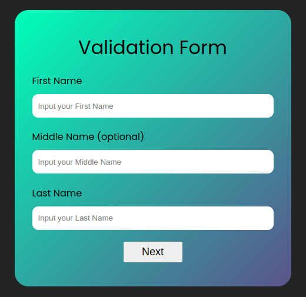

# Multi Step Validation Form

- This is a multi Step Validation Form written in Html, CSS and Javascript.

## Structure
- This project has been with 8 different files inside of it.
1. index.html
- This is the first page that you are gonna see once you are live. There is a **FORM** element where all the html code has been written. And inside the form element there are **DIV** containers which will have inputs with label in it. and at last there will be a **BUTTON** element with the type **SUBMIT**. 
2. index.js
- this is the js file that is linked with index.html. There are three different elements **FIRST NAME** **MIDDLE NAME** **LAST NAME **. Each input from the user are gonna be selected and manipulate from this file.
3. second_page.html
- This is the second .html page. This page has the same structure as the first one but different elements. The inputs are for **EMAIL** **PASSWORD** **CONFIRM PASSWORD**. And with a button for previous and next.
4. second.js
- this is the js file that is linked with the second html file. Same as the first js file but the code in this file are to target the inputs for **EMAIL, PASSWORD CONFIRM PASSWORD**. To validate the email we are using **REGULAR EXPRESSION**. The email input has to match the format with the regular expression. And for the password section, it cannot be blank and the both the password need to be the same or it is gonna show error. 
5. last_page.html
- This is the last page and also with same format as the other html files. The inputs that this file is expecting are **USERNAME, DATE OF BIRTH PHONE NUMBER**. Again the username and phone number are validated using **REGULAR EXPRESSION** and as for the date of birth, It cannot be blank.
6. last.js
- This is the js file linked with the last_page.html but not the last page.  All the inputs from the last_page.html file are selected and manipulated here.
7. info.html
- This is the final page that the user is gonna see. This page is gonna display the user all the information that the user gave in a single page. Since there was gonna be a small amount of code compared to other files, the html codes and the js code has been written in this single file.
8. style.css
- All the styling has been written in this file. All the html files for this project is linked with this same .css file.
